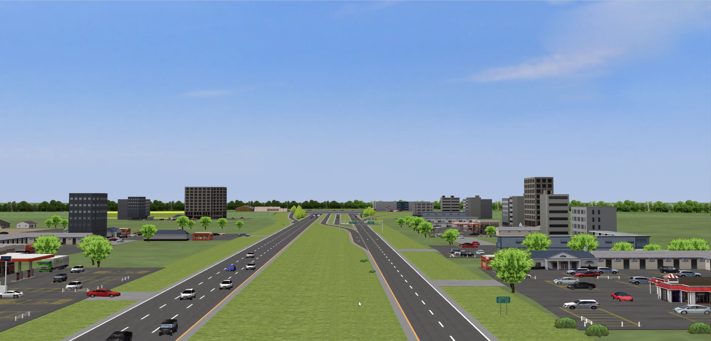

<h1 align="center">CURRENT PROJECTS</h1>
<!-- 
Projects
 -->
---

 

## 1. EMG-based Assistive Human-Machine Interface Design 

 

This is an NSF-funded project to develop models of powered-prosthetic user cognitive workload when applying different modes of electromyography (EMG)-based device control. Models are to be used for predicting workload associated with use of EMG-based control interfaces in other applications.      

<a href="">READ MORE</a>  

## 2. Real-time Perceptually-enabled Task Guidance in the Extremes 

 

This a DARPA-funded project on the use of augmented reality for providing knowledge task guidance in extreme situations. The research challenge is to create a data-to-knowledge "pipeline" from wearable devices to an intelligent agency that can determine what information or guidance to provide to human operators in real-time.     

<a href="">READ MORE</a>  

## 3. NSF REU Site in Advanced Manufacturing and Supply Chain 

 

This new three-year REU project entitled REU Site in Advanced Manufacturing and Supply Chain (AMSC) at the University of Louisville will provide a 10-week summer experiential training. REU students will work closely with faculty mentors on cutting-edge research projects that are motivated from real world problems. The AMSC REU students will also participate in professional development opportunities such as workshops, training sessions, research presentations, and plant tours.   

<a href="https://www.aqlanlab.org/research/reu/project-6" target="_blank">READ MORE</a>  

<h1 align="center">PAST PROJECTS</h1>
---
 

## 1. Research on Automation Rate and Situation Awareness Responses 

 

During the operation of automated systems, if a user cannot accurately understand the structure and function of automation of the system, it is likely that distrust or over-trust in the automation will occur. To address this research gap, my dissertation research developed a continuous “automation rate (AR)” function to quantify levels of automation in complex  systems. In addition, I proposed a new relationship between the AR function and operator situation awareness responses, based on existing empirical research findings.   
<a href="">READ MORE</a>  

## 2. Roadway Signage for Novel Grade-separated Interchanges 

 

This is an NCDOT-funded project that used a driving simulator to compare the driving performance and mental state of young and middle-aged drivers while navigating standard intersections and novel GSI (contraflow and quadrant) conditions. The experiment also manipulated driver exposure to different configurations of lane assignment and decision point signs.     

<a href="">READ MORE</a>  

## 3. Other Projects 

 

In addition to the above research studies, I have also been involved in other projects on systems safety analysis research, unmanned aerial vehicle interface design, consistency in the design of interchanges in high-density traffic corridors and non-safety-related in-vehicle and on-road message displays.      

<a href="">READ MORE</a>  

<!--  
<body></body> -->